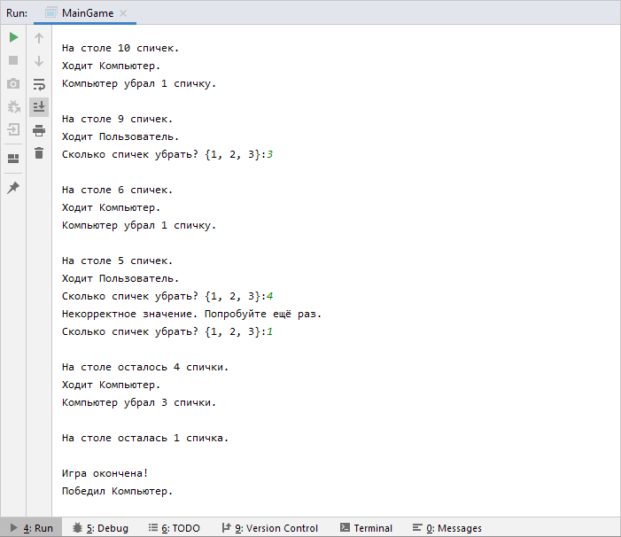

# **ИГРА "20 СПИЧЕК"**

ПРАВИЛА ИГРЫ  
- Начальные условия: на столе лежит 20 спичек. Первый ход компьютера.   
- Игроки ходят по очереди, убирая на выбор 1, 2 или 3 спички.  
- Проигравшим считается тот, кто возьмёт со стола последнюю спичку.  
   
ТРЕБОВАНИЯ К ПРОГРАММЕ  
*\- Программа объявляет в консоли следующие события:*  
>- [x] МОМЕНТ НАЧАЛА ИГРЫ.  
>- [x] ОСТАВШЕЕСЯ КОЛИЧЕСТВО СПИЧЕК ПОСЛЕ КАЖДОГО ХОДА.  
>- [x] КТО ВЫПОЛНЯЕТ ТЕКУЩИЙ ХОД.  
>- [x] МОМЕНТ ОКОНЧАНИЯ ИГРЫ И ПОБЕДИТЕЛЯ.  
  
  
*\- При вводе в консоль недопустимого числа спичек для взятия со стола выводится ошибка и предложение повторного ввода.*
  
Пример работы программы:
  

:copyright:yaro4luck
 
